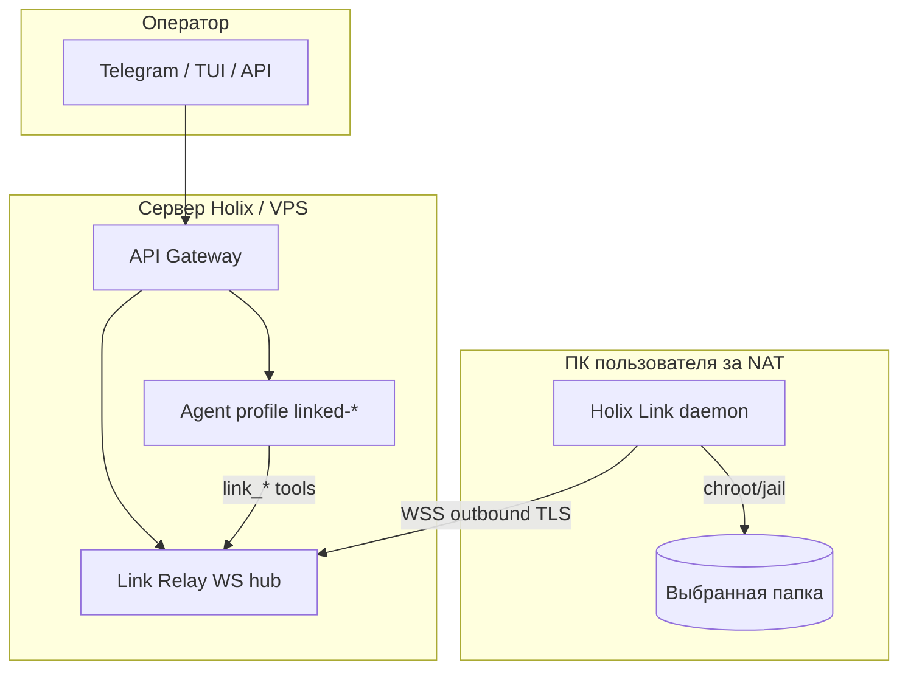

# Holix Link — удалённый доступ агента к папке пользователя

**Статус:** черновик на согласование (реализация не начата)  
**Ветка:** `feature/remote-folder-agent`  
**Версия документа:** 0.3  
**Дата:** 2026-06-12

---

## 1. Проблема

Сейчас Holix-агент работает **локально** на машине, где установлен CLI/gateway: файловые инструменты, терминал и workspace jail привязаны к `~/.holix/profiles/<name>/`. Удалённый оператор (другой сервер, Telegram, веб-UI) не может безопасно работать с **произвольной папкой на ПК пользователя** без:

- проброса портов и открытия gateway в интернет;
- полной установки Holix (агент, память, MCP, gateway) на ПК пользователя.

Нужно **отдельное лёгкое приложение Holix Link** — **без локального агента Holix**: пользователь выбирает папку, клиент подключается к **удалённому** gateway, агент **на сервере** видит только эту папку — **за NAT**, с **шифрованием** и **простой отвязкой**.

---

## 2. Предлагаемое решение: **Holix Link**

**Два независимых артефакта:**

| Артефакт | Где ставится | Что включает |
|----------|--------------|--------------|
| **`Holix-Link`** (PyPI) | ПК пользователя | Только клиент: pairing, daemon, jail FS, WSS — **без** `holix`, агента, ChromaDB, LangGraph, MCP |
| **`Holix`** (существующий пакет) | Сервер / VPS | Gateway + Link Relay + агент + `holix link create` |

На машине пользователя **не устанавливается** полный Holix и **не создаётся** `~/.holix/profiles/`. Локально — только `holix-link` и каталог данных Link (§9.1).

| Роль | Где работает | Задача |
|------|--------------|--------|
| **Holix Link (клиент)** | ПК/ноутбук пользователя | Выбор папки, исходящее WSS к gateway, RPC файловых операций в jail |
| **Link Relay (сервер)** | Gateway на VPS / `holix-agent.ru` | Приём сессий Link, маршрутизация к агенту профиля `linked-<id>` |
| **Агент Holix** | Только на сервере | `link_read_file`, `link_list_dir`, … — удалённый FS через bridge |

**Ключевая идея:** клиент **сам** устанавливает исходящее соединение (WebSocket over TLS). Входящих портов на стороне пользователя не нужно — работает за NAT/CGNAT.

Синхронизация целой папки на сервер **не используется** в MVP: агент работает с **живым удалённым каталогом** через RPC (меньше диска на сервере, актуальные данные). Опциональная «офлайн-копия» — фаза 3.

---

## 3. Цели и ограничения

### Цели (MVP)

- Установка **только Holix Link** за **1–2 команды** — без `pip install Holix`, без bootstrap агента.
- Размер клиента: целевой **&lt; 15 MB** wheel, **5–8** прямых зависимостей (httpx/websockets, cryptography, typer, rich).
- Пользователь **явно выбирает папку** (и может сменить только после переподключения).
- **Pairing** по одноразовому коду / QR (как Telegram access request).
- Трафик **TLS 1.3** + подписанные сообщений на уровне приложения.
- Работа **за NAT** (outbound-only).
- На сервере — **отдельный профиль** или режим `link` с workspace jail = удалённая папка.
- **Отзыв** связи с любой стороны, аудит операций.
- **Паритет платформ:** клиент Holix Link с первого релиза на **Windows 10+**, **Linux** (glibc systemd/non-systemd), **macOS 12+** (Intel + Apple Silicon).

### Не входит в MVP

- Произвольный shell на клиентской машине (только файлы; терминал — фаза 2 с отдельным согласием).
- Доступ ко всей файловой системе клиента.
- P2P без relay-сервера (рассмотрено, отложено).
- Нативные GUI macOS/Windows (сначала CLI + опционально минимальный web wizard на `127.0.0.1`).

### Нефункциональные требования

- Latency: list/read &lt; 2 с на типичном канале; streaming read для больших файлов.
- Переподключение после sleep/reboot клиента без повторного pairing (пока не отозван ключ).
- Совместимость: Python 3.12+ на **Windows, Linux, macOS** (единая кодовая база, без форка).
- CI: матрица `ubuntu-latest`, `macos-latest`, `windows-latest` для клиента и jail-тестов.

---

## 4. Пользовательские сценарии

### 4.1 Подключение (pairing)

1. Админ на сервере: `holix link create --profile support` → код `LINK-7K3M-9Q2P` (TTL 10 мин).
2. Пользователь на ПК:
   - Linux/macOS: `holix-link pair LINK-7K3M-9Q2P --folder ~/Projects/acme`
   - Windows: `holix-link pair LINK-7K3M-9Q2P --folder C:\Users\me\Projects\acme`
3. Клиент показывает fingerprint сервера; пользователь подтверждает.
4. Сервер создаёт запись `link_id`, профиль `linked-acme` с `workspace_root` = виртуальный корень.
5. Агент в Telegram/веб: «Папка Acme подключена».

### 4.2 Работа агента

- Оператор пишет в Telegram профиля `support`: «Прочитай README в корне».
- Агент вызывает `link_read_file("README.md")` → RPC → клиент читает `~/Projects/acme/README.md` → ответ.

### 4.3 Отзыв

- `holix link revoke <link_id>` на сервере **или** `holix-link disconnect` на клиенте.
- Все сессии и refresh-токены инвалидируются.

---

## 5. Архитектура



### Поток данных

1. **Control plane:** pairing, revoke, status — HTTP на gateway (`/v1/link/*`).
2. **Data plane:** постоянный **WebSocket** клиент → relay; запросы файловых операций с `request_id`, таймаут, размерные лимиты.
3. **Агент** не ходит на клиент напрямую — только через `LinkBridge` в процессе gateway.

---

## 6. Безопасность

### 6.1 Модель угроз

| Угроза | Митигация |
|--------|-----------|
| Перехват трафика | TLS 1.3 (WSS), certificate pinning опционально |
| Подмена сервера | Отображение fingerprint при pairing; TOFU + опциональный `HOLIX_LINK_TRUSTED_FP` |
| Компрометация pairing-кода | TTL 10 мин, одноразовость, rate limit |
| Расширение scope | Жёсткий `workspace_root` на клиенте; все пути нормализуются и проверяются (`..` запрещён) |
| Утечка через агента | Отдельный профиль link; без терминала в MVP; whitelist расширений файлов опционально |
| Украденный device token | Refresh rotation, revoke, короткий TTL access token |

### 6.2 Шифрование (слои)

| Слой | Механизм |
|------|----------|
| Транспорт | TLS 1.3 (обязательно) |
| Аутентификация сессии | Ed25519 keypair на клиенте при первом pair; сервер хранит public key |
| Сообщения RPC | JSON + HMAC-SHA256 или подпись Ed25519 (`link_session_key`) |
| Секреты at rest | `~/.holix/link/credentials.json` chmod 600; OS keychain — фаза 2 |

Полное E2E без расшифровки на relay **не требуется в MVP**, если relay на том же доверенном gateway. Для multi-tenant SaaS — фаза 2: envelope encryption per link.

### 6.3 Права на клиенте

- Переиспользовать **`workspace_jail`** из `core/tools/` — тот же код нормализации путей.
- Запрет symlink-escape (resolve realpath внутри jail).
- Лимиты: max file size read (например 10 MB MVP), max list entries, rate limit RPC/мин.

---

## 7. Обход NAT

**Выбранный подход:** persistent **outbound WebSocket** от клиента к `wss://<gateway>/v1/link/ws`.

| Альтернатива | Почему не MVP |
|--------------|---------------|
| Reverse SSH tunnel | Сложная установка для пользователя |
| WireGuard | Нужны права админа, конфиг сети |
| STUN/TURN P2P | Сложность, нестабильность CGNAT |
| Tailscale/ZeroTier | Внешняя зависимость, не «одно приложение Holix» |

**Reconnect:** exponential backoff; при долгом offline агент видит статус `link_offline`; очередь запросов не буферизуется (fail fast).

**Self-hosted:** relay встроен в существующий `holix gateway` — отдельный порт не нужен, тот же TLS termination на nginx.

---

## 8. Установка (UX)

### Принцип: на ПК пользователя — только Holix Link

```text
Пользователь НЕ выполняет:
  pip install Holix
  holix bootstrap
  holix gateway start
  holix models setup

Пользователь выполняет ТОЛЬКО:
  pipx install Holix-Link   # или install-link.sh / install-link.ps1
  holix-link wizard
```

Команда `holix` на клиентской машине **отсутствует**. Pairing-код выдаёт админ **на сервере** (Telegram, email, support-портал).

### Клиент — все платформы

| Платформа | Установка | Требования |
|-----------|-----------|------------|
| **Linux** | `pipx install Holix-Link` или `curl … \| bash` | Только Python 3.12+ |
| **macOS** | `pipx install Holix-Link` или `curl … \| bash` | Только Python 3.12+ |
| **Windows** | `pipx install Holix-Link` или `install-link.ps1` | Только Python 3.12+ |

CLI клиента — **`holix-link`** (отдельная entry point, не `holix link`):

```bash
holix-link wizard           # pairing + папка + daemon
holix-link pair CODE --folder ~/work
holix-link status
holix-link disconnect
holix-link install-service  # автозапуск (§9)
```

### Сервер (полный Holix — уже установлен)

```bash
holix link create --profile support --ttl 10m
holix link list
holix link revoke <id>
```

Relay и агент — часть пакета **`Holix`** на gateway; обновление сервера: `pip install -U Holix` + `holix gateway reload`.

---

## 9. Кроссплатформенная поддержка (Windows / Linux / macOS)

Клиент Holix Link — **не серверный** компонент: он ставится на машину пользователя с любой из трёх ОС. Архитектура протокола и relay **одинаковая**; отличаются только пути, фоновый сервис и edge-cases ФС.

### 9.1 Каталоги данных (отдельно от Holix-агента)

Клиент **не использует** `~/.holix/profiles/`. Собственный корень данных:

| Переменная | Путь по умолчанию |
|------------|-------------------|
| `HOLIX_LINK_HOME` | переопределение |
| Linux / macOS | `~/.holix-link/` |
| Windows | `%LOCALAPPDATA%\HolixLink\` |

Содержимое: `credentials.json`, `config.json` (folder, link_id, server URL), `link.log`, `daemon.pid`.

> Если на той же машине позже установят полный Holix — каталоги **не пересекаются** (`~/.holix-link/` ≠ `~/.holix/`).

Права: Unix `chmod 600` на секреты; Windows — ACL только для текущего пользователя (фаза 1), DPAPI — фаза 2.

### 9.2 Выбор папки (workspace jail)

| ОС | MVP | Фаза 2 |
|----|-----|--------|
| Все | Аргумент `--folder <path>` в CLI | `holix-link wizard` с нативным диалогом |
| Linux/macOS | `~/…`, `/home/…` | `zenity` / AppleScript `choose folder` |
| Windows | `C:\Users\…`, UNC `\\server\share` (read-only share — осторожно) | PowerShell `FolderBrowserDialog` |

**Нормализация путей** (`integrations/link/paths.py`):

- Внутреннее представление: POSIX-style относительно jail root (`src/main.py`).
- Windows: `Path.resolve()`, поддержка длинных путей (`\\?\` при &gt;260 символов).
- Запрет: `..`, absolute escape, **junction/symlink** за пределы jail (`os.path.realpath` / `Path.resolve(strict=False)` с проверкой `is_relative_to`).

Отдельный набор тестов: `tests/test_link_paths_windows.py` (моки `sys.platform`), `test_link_jail_unix.py`.

### 9.3 Фоновый daemon (автозапуск)

Единая команда: `holix-link install-service` / `holix-link uninstall-service`.

| ОС | Механизм | Заметки |
|----|----------|---------|
| **Linux** | systemd **user** unit `holix-link.service` | `WantedBy=default.target`, перезапуск при обрыве WS |
| **macOS** | LaunchAgent `~/Library/LaunchAgents/ru.holix.link.plist` | `RunAtLoad`, `KeepAlive` |
| **Windows** | Планировщик задач **или** `nssm`/pywin32 Service | MVP: Task Scheduler «при входе» + `--foreground` fallback; полноценная Service — фаза 2 |

Без прав администратора: только user-level сервисы (не `/Library/LaunchDaemons`, не system systemd).

Остановка: `holix-link stop` → корректный SIGTERM (POSIX) / `GenerateConsoleCtrlEvent` (Windows) через `core/platform_compat.terminate_process`.

### 9.4 Сеть и NAT

На всех ОС — **только исходящие** TCP 443 (WSS). Входящие порты и правила firewall на клиенте не нужны.

| ОС | Типичные ограничения |
|----|---------------------|
| Windows | Корпоративный прокси — фаза 2: `HTTPS_PROXY` для WebSocket |
| macOS | Little Snitch / firewall — пользователь разрешает исходящее к gateway |
| Linux | `iptables` OUTPUT обычно разрешён |

Sleep/hibernate: при пробуждении — автоматический reconnect (все платформы).

### 9.5 Установщики

| Скрипт | Платформа |
|--------|-----------|
| `scripts/install-link.sh` | Linux + macOS (проверка `python3.12`, `pipx`, PATH) |
| `scripts/install-link.ps1` | Windows (проверка Python, `pipx`, добавление в PATH) |

Документация: `docs/en/LINK.md`, `docs/ru/LINK.md` — отдельные подразделы per OS.

### 9.6 CI и ручная матрица

```yaml
# .github/workflows/link-client.yml (план)
strategy:
  matrix:
    os: [ubuntu-latest, macos-latest, windows-latest]
    python: ["3.12", "3.13"]
```

Проверки: pairing mock, jail escape, path normalize, daemon start/stop (smoke), `holix doctor --link` (план).

### 9.7 Зависимости клиента (отдельный `pyproject.toml`)

Пакет **`Holix-Link`** — свой репозиторий / subdirectory `packages/holix-link/` в монорепо, **не** зависит от `Holix`:

| Включено | Исключено намеренно |
|----------|---------------------|
| `httpx`, `websockets`, `cryptography`, `typer`, `rich` | `chromadb`, `langgraph`, `openai`, `textual`, `mcp` |
| `pydantic` (протокол RPC) | `fastapi`, `uvicorn` (только на сервере) |

Опционально: `Holix-Link[windows]` → `pywin32` для Task Scheduler.

Публикация: отдельный PyPI-проект `Holix-Link`, версионирование синхронно с gateway-частью в `Holix` (например Link 0.1.0 ↔ Holix 0.1.13).

---

## 10. Компоненты кодовой базы

| Компонент | Пакет | Описание |
|-----------|-------|----------|
| `holix_link/` (клиент) | **Holix-Link** | CLI `holix-link`, daemon, jail, pairing, service install |
| `holix_link/protocol.py` | **Holix-Link** + **Holix** | Общий контракт RPC (shared wheel `holix-link-protocol` или vendored copy) |
| `api/routers/link.py` | **Holix** | REST + WebSocket relay на gateway |
| `core/tools/link_fs.py` | **Holix** | Agent tools `link_*` |
| `cli/commands/link.py` | **Holix** | `holix link create|list|revoke` (сервер) |
| `scripts/install-link.sh` / `.ps1` | **Holix-Link** | Установщик **только клиента** |
| `docs/en|ru/LINK.md` | оба | Клиент vs сервер — явно разделены |

Переиспользование **на сервере** (пакет Holix): `ProfileManager`, pairing UX как в Telegram access approval.

Клиент **не импортирует** `cli/`, `core/agent`, `api/` — только тонкий слой path jail (скопирован или вынесен в `holix-link-protocol`).

---

## 11. Протокол (черновик)

### WebSocket: клиент → сервер (после pair)

```json
{"type": "rpc_result", "id": "uuid", "ok": true, "payload": {"entries": ["a.txt", "src/"]}}
```

### WebSocket: сервер → клиент

```json
{"type": "rpc_call", "id": "uuid", "op": "list_dir", "path": "src", "limit": 200}
```

Операции MVP: `list_dir`, `read_file`, `write_file`, `stat`, `mkdir` (опционально выкл.), `delete` (выкл. по умолчанию).

---

## 12. План реализации по фазам

> **Важно:** код пишется только после согласования этого документа.

### Фаза 0 — Согласование (текущий этап)

- [ ] Утвердить название (Holix Link / другое)
- [ ] Утвердить: только файлы в MVP или нужен read-only
- [x] Клиент — **отдельный PyPI `Holix-Link`**, без локального агента Holix
- [ ] Утвердить: монорепо (`packages/holix-link/`) vs отдельный git-репозиторий
- [ ] Утвердить модель хостинга relay (только self-hosted gateway / managed cloud)
- [x] Поддержка клиента: **Windows + Linux + macOS** (обязательно в MVP)

### Фаза 1 — MVP (оценка 4–5 недель с кроссплатформой)

| PR | Содержание | Зависимости |
|----|------------|-------------|
| **PR-1** | Спецификация протокола + типы (`integrations/link/protocol.py`) | — |
| **PR-2** | `integrations/link/paths.py` + jail (Unix + Windows path tests) | PR-1 |
| **PR-3** | Gateway: `POST /v1/link/pair`, `WS /v1/link/connect`, `links.db` | PR-1 |
| **PR-4** | Клиент: `holix-link pair`, daemon, jail executor (все ОС) | PR-2, PR-3 |
| **PR-5** | `holix-link install-service` — systemd / LaunchAgent / Task Scheduler | PR-4 |
| **PR-6** | Agent tools `link_*` + профиль `linked-*` auto setup | PR-3 |
| **PR-7** | CLI `holix link create|list|revoke`, doctor checks | PR-3 |
| **PR-8** | CI `link-client.yml` matrix (ubuntu, macos, windows) | PR-4, PR-5 |
| **PR-9** | Установщики `install-link.sh` + `install-link.ps1` | PR-4 |
| **PR-10** | Документация EN/RU (§ per OS) + `holix docs build` | PR-7, PR-9 |

**Критерий готовности MVP:** пользователь за NAT на **Windows, Linux или macOS** подключает папку; оператор через Telegram-профиль на сервере читает файл из этой папки; после перезагрузки клиента связь восстанавливается (`install-service`).

### Фаза 2 — Усиление (2 недели)

- Read-only режим по умолчанию + toggle `holix link grant write`
- OS keychain: **Keychain** (macOS), **Credential Manager** (Windows), **secretstorage** (Linux)
- Нативный диалог выбора папки в `wizard`
- Windows: полноценная Service + корпоративный `HTTPS_PROXY`
- Ограничение MIME/расширений
- Статус в `holix gateway status` / Prometheus метрики
- Уведомление клиенту при каждой записи файла

### Фаза 3 — Опционально

- Терминал в sandbox (ограниченный whitelist на клиенте) — отдельное согласие
- Selective sync кэша для офлайн-read
- Desktop tray app (Tauri/Electron)
- Managed relay для пользователей без своего VPS

---

## 13. Альтернативы (кратко)

| Подход | Плюсы | Минусы |
|--------|-------|--------|
| **Sync папки на сервер** | Проще для агента (локальный FS) | Диск, задержка, конфликты, не «живые» данные |
| **Только SSH reverse tunnel** | Зрелый протокол | Сложная установка, ключи SSH для пользователей |
| **Расширить `holix tui --web`** | Уже есть web UI | Нужен входящий порт / VPN; не NAT-friendly |
| **Telegram-only file upload** | Уже работает | Не папка, не непрерывный доступ |

**Рекомендация:** outbound Link Relay — лучший баланс простоты установки и безопасности для Holix.

---

## 14. Вопросы для согласования

См. список в конце документа и ответы пользователя — после этого версия **1.0**.

### Уже согласовано (v0.3)

| # | Решение |
|---|---------|
| — | Клиент: **Windows + Linux + macOS** |
| — | На ПК пользователя ставится **только Holix Link**, без локального агента `Holix` |

---

## 15. Следующий шаг после согласования

1. Зафиксировать ответы на вопросы ниже в этом файле (версия 1.0).
2. Создать issue/PR stack по таблице Фазы 1.
3. Начать с **PR-1** (протокол + тесты контракта без сети).

---

---

## 16. Анкета (ответьте на все пункты)

Скопируйте блок и заполните:

```
1. Имя продукта: 
2. MVP — доступ к файлам: read-only / read+write / write по запросу
3. Репозиторий клиента: монорепо packages/holix-link / отдельный repo
4. Каталог данных клиента: ~/.holix-link / другое: ___
5. Кто выдаёт pair-код: только admin / любой владелец профиля / оба
6. Сколько link на один серверный профиль: 1 / N (макс: ___)
7. Telegram: тот же бот / отдельный / не нужен в MVP
8. Хостинг relay: только self-hosted / managed holix-agent.ru / оба
9. Уведомления на клиенте при доступе агента: да / нет / только запись
10. UNC/сетевые папки Windows в MVP: да / нет
```

---

*Документ подготовлен для ветки `feature/remote-folder-agent`. Изменения в коде до approval не вносятся.*