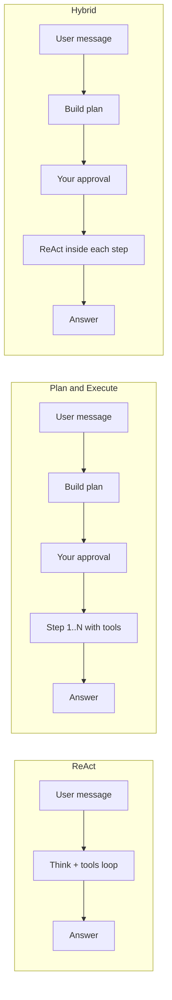

# Execution Modes

Holix runs the agent through a **LangGraph** workflow. The **execution mode** decides how the graph plans, calls tools, and asks for your approval.

Modes are available in **TUI** (`holix tui`), **Telegram**, and **web TUI** (`holix tui --web`). Switch with **`/mode`** or **`/mode <name>`**.

| Mode | System name | Best for |
|------|-------------|----------|
| **ReAct** | `react` | Single questions, quick tool use, exploration (default) |
| **Plan & Execute** | `plan_and_execute` | Multi-step work with clear subgoals |
| **Hybrid** | `hybrid` | Large tasks: structured plan, flexible work inside each step |
| **Auto** | `auto` | Let Holix pick `react`, `plan_and_execute`, or `hybrid` |

```text
/mode react
/mode plan_and_execute
/mode hybrid
/mode auto
```

Check the active mode: `/status`.

---

## How modes differ (at a glance)



| | ReAct | Plan & Execute | Hybrid |
|---|-------|----------------|--------|
| Plan before tools | No | Yes | Yes |
| Tool loop style | One continuous loop | Per plan step | ReAct within each step |
| Good task size | Small–medium | Medium, structured | Large, open-ended |
| User approvals | Tool risk only | Plan + optional per-step | Plan + optional per-step |

---

## ReAct (`react`)

**Default mode.** The agent alternates between reasoning and tool calls until it can answer or hits `max_steps`.

### When to use

- One clear question or action
- Reading a file, running a command, web search
- Debugging a single error
- “Try this and tell me what happened”

### How it behaves

1. You send a message.
2. The model may call tools (`read_file`, `run_terminal_command`, …).
3. Results go back to the model; the loop continues.
4. You get a final answer (or hit the step limit).

Risky tools still ask for `/yes` or `/1`–`/4` confirmation.

### Prompt examples

**Good**

```text
Read README.md and summarize the project in 5 bullet points.
```

```text
Run `git status` in the repo root and explain which files are modified.
```

```text
Search the web for Holix on PyPI and tell me the latest version.
```

```text
Find where `plan_review_enabled` is defined in this codebase and show the default value.
```

**Weak for ReAct (consider Plan or Hybrid)**

```text
Migrate the whole project to pyproject.toml, add CI, write tests, and update the docs.
```

Too many independent phases — split the goal or switch mode.

---

## Plan & Execute (`plan_and_execute`)

The agent **writes a step-by-step plan first**, shows it for approval, then executes steps in order.

### When to use

- Refactors with several checkpoints
- Setup flows (“install → configure → verify”)
- Tasks where you want to see the roadmap before tools run

### How it behaves

1. **Plan** — LLM produces numbered steps.
2. **Review** — if `plan_review_enabled=true` (default), you approve, refine, or reject:
   - `/plan-confirm` — run the current step
   - `/plan-auto` — run the rest without asking per step
   - `/plan-refine` — ask to change the plan (you can add text)
   - `/plan-reject` — cancel
3. **Execute** — each step runs with tools; after a step completes, orchestration moves to the next.
4. **Finalize** — summary when all steps are done.

Inside a step, the agent uses a ReAct-style loop (limited by `max_steps_per_plan_step`, default **5**).

### Prompt examples

**Good**

```text
Add pytest coverage for core/graph/routers.py:
1) list existing tests
2) add missing cases for route_after_react_plan
3) run pytest and fix failures
```

```text
Prepare this repo for a release:
1) bump version in pyproject.toml and config
2) update CHANGELOG Unreleased section
3) run tests
4) summarize what to tag on git
```

```text
Onboard a new developer machine:
1) verify Python 3.12 and uv
2) run holix doctor
3) run holix models setup with local Ollama
4) print next steps from START_HERE.md
```

**Good (shorter — Holix will expand the plan)**

```text
Refactor cli/commands/profile.py: extract whitelist helpers to a module, add tests, keep CLI behaviour unchanged.
```

**Weak for Plan**

```text
What is 2+2?
```

Use **ReAct** or **Auto** for trivial questions.

---

## Hybrid (`hybrid`)

Like Plan & Execute for the **planning phase**, but each approved step runs as a **full ReAct loop** (more flexibility, more tool iterations per step).

### When to use

- Design + implementation (“architecture first, then code”)
- Research then build
- Tasks where steps are broad (“implement auth”, “add API tests”) and need exploration inside each step

### How it behaves

1. Plan and review (same slash commands as Plan mode).
2. After approval, the graph enters **ReAct** for the current step instead of a short fixed loop.
3. When the step is marked complete, orchestration advances to the next step.

Use when steps are **goals**, not micro-commands.

### Prompt examples

**Good**

```text
Design and implement a small health-check endpoint for the gateway:
- first propose URL, response schema, and auth
- then implement in api/gateway.py
- then add a pytest and document in GATEWAY.md
```

```text
Improve docs-site search:
- analyze current build.py and search-index format
- propose ranking improvements
- implement and rebuild with holix docs build
```

```text
Investigate slow Telegram responses:
- inspect event handler and streaming path
- suggest bottlenecks
- implement one optimization with tests
```

**Weak for Hybrid**

```text
List files in the current directory.
```

Use **ReAct**.

---

## Auto (`auto`)

Holix sends your message to a **lightweight classifier** (small LLM call) that picks `react`, `plan_and_execute`, or `hybrid`.

### When to use

- You do not want to think about modes
- Mixed session: quick questions and larger tasks
- Onboarding new users

### How it behaves

1. Classifier reads the task (first ~500 characters).
2. Returns one of: `react`, `plan_and_execute`, `hybrid`.
3. That graph runs for **this message only** (mode stays `auto` for the next message).

On timeout, invalid output, or missing LLM client → falls back to **`react`**.

Strategic memory can bias the choice if it contains mode hints.

### Prompt examples

**Likely → ReAct**

```text
Explain what HOLIX_DOCS_CHAT_ENABLED does.
```

```text
Show the last 20 lines of gateway.log for this profile.
```

**Likely → Plan & Execute**

```text
Rename env variable docs_chat_token to HOLIX_DOCS_CHAT_TOKEN across code and docs, then run tests.
```

```text
Add a new CLI subcommand following the pattern of profile jail: implementation, tests, CLI.md section.
```

**Likely → Hybrid**

```text
Research how other projects document execution modes, then write EXECUTION_MODES.md for Holix with examples.
```

```text
Plan a multi-profile deployment for three teams, then generate example .env snippets and systemd units.
```

**Tip:** In **Auto**, write the **goal and constraints** clearly; the classifier uses wording like “steps”, “migrate”, “design and implement”, “refactor and test”.

---

## Plan review and confirmations

### Plan approval (Plan & Hybrid)

| Command | Action |
|---------|--------|
| `/plan-confirm` | Approve and run the current step |
| `/plan-auto` | Run remaining steps automatically |
| `/plan-refine` | Request plan changes (add details in the next message) |
| `/plan-reject` | Cancel the plan |

In Telegram — same commands and inline buttons.

If `plan_review_enabled=false` in settings, plans auto-execute without review (use only in trusted automation).

### Risky tool confirmation (all modes)

| Command | Meaning |
|---------|---------|
| `/yes`, `/1` | Allow once |
| `/2` | Allow for this session |
| `/3` | Allow always (persisted) |
| `/no`, `/4` | Deny |

During `/plan-auto`, plan-step tools may auto-approve per security policy.

---

## Configuration

Profile `.env` / settings (see [.env.example](../../.env.example)):

| Variable | Default | Effect |
|----------|---------|--------|
| `plan_review_enabled` | `true` | Show plan for approval |
| `plan_review_timeout` | `600` | Seconds to wait for plan decision |
| `max_steps_per_plan_step` | `5` | Tool iterations per step in Plan mode |
| `max_steps` | `15` | Global graph step limit |

Execution mode itself is a **session setting** in TUI/Telegram (not usually stored in `.env`). Use `/mode` or Shift+Tab.

---

## Choosing a mode (cheat sheet)

| Your task | Suggested mode |
|-----------|----------------|
| Quick lookup, one file, one command | `react` |
| Checklist with 3–8 concrete steps | `plan_and_execute` |
| “Figure out approach, then build” | `hybrid` |
| Unsure | `auto` |
| Production script / API (no UI) | Set graph mode in API or use `plan_review_enabled=false` carefully |

---

## Related docs

- [SLASH_COMMANDS.md](SLASH_COMMANDS.md) — `/mode`, `/plan-*`, `/status`
- [TUI.md](TUI.md) — Shift+Tab, web UI
- [USER_GUIDE.md](USER_GUIDE.md) — full walkthrough
- [ARCHITECTURE.md](ARCHITECTURE.md) — LangGraph and runtime