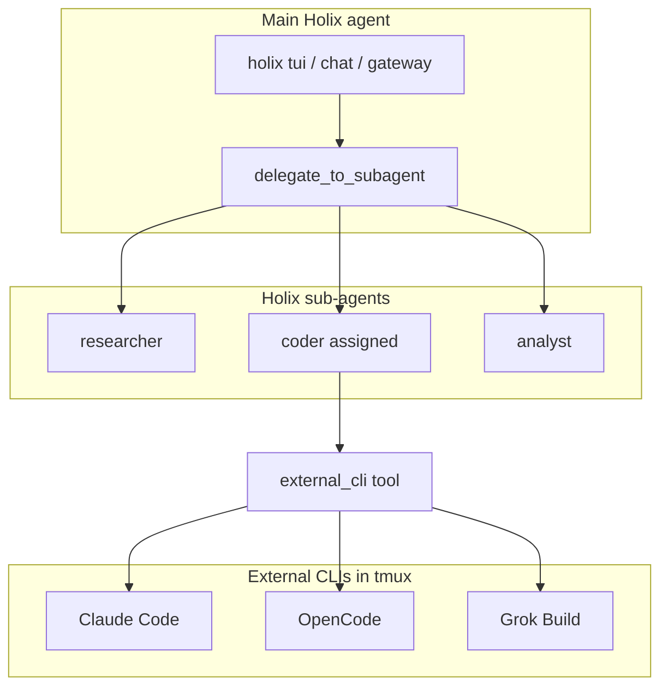

# Holix sub-agents and `holix launch`

How **Holix sub-agents** relate to **`holix launch`** (external coding CLIs in tmux).

## Two parallel paths



| | Holix sub-agents | `holix launch` (terminal) |
|---|---|---|
| **What** | Background workers inside Holix | Separate terminal agents in tmux |
| **Start** | `delegate_to_subagent` | `holix launch …` (manual) or `external_cli` from assigned sub-agent |
| **Process** | asyncio or separate Holix OS process | Own binary (`claude`, `opencode`, `grok`) |
| **Model** | **Parent** model (`config.yaml` / default) | **Slot** model (`coder` by default) → `agent_models.coder` |
| **Tools** | Fixed set from registry (+ `external_cli` when assigned) | CLI's own tools |

---

## What the main agent can do

With `enable_subagents: true`, the main agent coordinates work but **does not launch external CLIs directly**:

1. **Sub-agents** — `delegate_to_subagent`, `wait_subagent_result`, `list_subagents`
2. **External CLIs** — only via an **assigned sub-agent** that has the `external_cli` tool (Linux/macOS only)

Example scenario:

```
User: "Research the API in the background and do the refactor in Claude Code"

Main agent:
  delegate_to_subagent(researcher, "gather API docs …")
  delegate_to_subagent(coder, "refactor auth module in Claude Code")

Sub-agent coder (if claude is assigned to coder in holix launch setup):
  external_cli(action=launch, cli_id=claude, task="refactor auth module")
```

While sub-agents run, the user can keep chatting with the main agent. The external CLI lives in its own tmux session.

---

## Sub-agent assignment for external CLIs

In `holix launch setup`, each enabled CLI binding stores:

| Field | Meaning |
|-------|---------|
| `enabled` | Whether this CLI is active for the profile |
| `model_slot` | Profile model slot for the external CLI (`coder`, …) |
| `agent_slot` | Sub-agent type allowed to call `external_cli` for this CLI |

Rules enforced by Holix:

- The **main agent** never sees `external_cli` in its tool list.
- A sub-agent gets `external_cli` **only** if at least one binding has `enabled: true` and `agent_slot` matching its type (e.g. `coder`).
- `external_cli(action=launch, …)` fails if the caller is not the assigned sub-agent, the binding is disabled, or `cli_id` is not configured.

```bash
holix launch setup
# Enable claude → Model slot: coder → Assign to sub-agent: coder
```

---

## What sub-agents can and cannot do

Each sub-agent type has a **base tool list** from the registry. For example, `coder`:

- `read_file`, `write_file`, `terminal`, `code_executor`
- `external_cli` — **added automatically** when a binding assigns an external CLI to `coder`

Sub-agents without assignment (`researcher`, `analyst`, …) cannot launch external CLIs.

---

## Important: two different "coder" names

| Name | Meaning |
|------|---------|
| Sub-agent `coder` | Holix worker type (code via `read_file` / `terminal`; may also use `external_cli` when assigned) |
| Profile slot `coder` | Model slot for `holix launch` (`--model-slot coder`) |

They are related via **`holix launch setup`**:

- `agent_slot: coder` — which sub-agent may call `external_cli`
- `model_slot: coder` — which profile model credentials are passed to the external CLI

Sub-agent `coder` still uses the **parent** model for its own Holix reasoning (`config.model`), not `agent_models.coder`.

From `holix models setup`:

```yaml
agent_models:
  coder:
    provider: litellm
    model: coder
```

→ affects **`holix launch`** / external CLI env, not the sub-agent's internal LLM model.

---

## Typical workflows

### 1. Main agent delegates; assigned sub-agent launches CLI

```
holix launch setup    # claude → enabled, agent_slot=coder

holix tui
  ├─ delegate_to_subagent(web_researcher) → background
  ├─ delegate_to_subagent(coder) → launches claude via external_cli
  └─ wait_subagent_result → include in user reply
```

### 2. Sub-agents only (no external CLIs)

Plan/Hybrid with `enable_subagents` — waves of `researcher` → `coder` → `reviewer`. All inside Holix; tmux not required.

### 3. External CLIs only (no sub-agents)

```bash
holix launch claude -t "fix tests"
holix launch chat <session_id>
```

The main Holix agent is not involved.

### 4. Manual parallelism

- One terminal: `holix launch opencode`
- TUI: sub-agent `analyst` on repo data

No automatic link — you coordinate both.

---

## Models and profile

| Component | Model source |
|-----------|--------------|
| Main agent | `default_model` / TUI selection |
| Sub-agent | Same as parent |
| `holix launch <cli>` / `external_cli` | Binding `model_slot` + CLI env/config mapping |

One profile → one API credentials set, but **different consumers**:

- sub-agents → Holix LLM API directly;
- launch → env / `opencode.json` / `config.toml` for the external CLI.

---

## Possible future work (not implemented)

1. **Map `agent_models.<type>` to sub-agent model** — align sub-agent `coder` internal model with launch slot `coder`.
2. **Plan orchestration → launch** — plan step "run grok-build with task X" via delegated sub-agent + `external_cli`.

---

## Summary

External CLIs are launched by the agent **only through assigned sub-agents** with enabled bindings. The main agent delegates; the sub-agent matching `agent_slot` runs `external_cli`. Manual `holix launch` from the terminal remains available anytime.

---

## See also

- [SUBAGENTS.md](SUBAGENTS.md) — how to spawn and manage sub-agents
- [LAUNCH.md](LAUNCH.md) — `holix launch`
- [ARCHITECTURE.md](ARCHITECTURE.md) — sub-agents and agent graph
- [CONFIGURATION.md](CONFIGURATION.md) — `enable_subagents`, `agent_models`