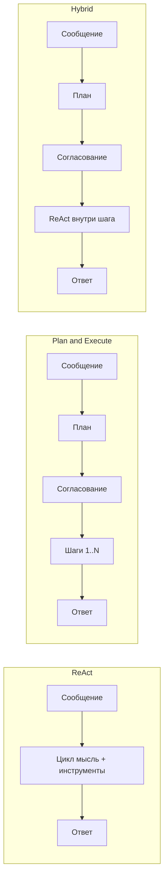

# Режимы работы (execution modes)

Holix запускает агента через **LangGraph**. **Режим работы** определяет, как граф строит план, вызывает инструменты и запрашивает ваше согласие.

Режимы доступны в **TUI** (`holix tui`), **Telegram** и **веб-TUI** (`holix tui --web`). Переключение: **`/mode`** или **`/mode <имя>`**.

| Режим | Системное имя | Когда использовать |
|-------|---------------|-------------------|
| **ReAct** | `react` | Одиночные вопросы, быстрые инструменты, разведка (по умолчанию) |
| **Plan & Execute** | `plan_and_execute` | Многошаговые задачи с понятными подцелями |
| **Hybrid** | `hybrid` | Крупные задачи: план + гибкая работа внутри каждого шага |
| **Auto** | `auto` | Holix сам выбирает один из трёх режимов выше |

```text
/mode react
/mode plan_and_execute
/mode hybrid
/mode auto
```

Текущий режим: `/status`.

---

## Чем режимы отличаются



| | ReAct | Plan & Execute | Hybrid |
|---|-------|----------------|--------|
| План до инструментов | Нет | Да | Да |
| Цикл инструментов | Один общий | По шагам плана | ReAct внутри шага |
| Размер задачи | Небольшая–средняя | Средняя, структурированная | Крупная, открытая |
| Согласования | Риск инструментов | План + опционально шаги | План + опционально шаги |

---

## ReAct (`react`)

**Режим по умолчанию.** Агент чередует рассуждение и вызовы инструментов, пока не ответит или не достигнет `max_steps`.

### Когда использовать

- Один понятный вопрос или действие
- Чтение файла, команда в терминале, поиск в вебе
- Разбор одной ошибки
- «Попробуй и скажи, что получилось»

### Как работает

1. Вы отправляете сообщение.
2. Модель может вызвать инструменты (`read_file`, `run_terminal_command`, …).
3. Результаты возвращаются в модель; цикл продолжается.
4. Финальный ответ (или лимит шагов).

Опасные инструменты по-прежнему требуют `/yes` или `/1`–`/4`.

### Примеры промптов

**Хорошие**

```text
Прочитай README.md и кратко опиши проект в 5 пунктах.
```

```text
Выполни `git status` в корне репозитория и объясни, какие файлы изменены.
```

```text
Найди в интернете Holix на PyPI и скажи последнюю версию.
```

```text
Найди в коде, где определён `plan_review_enabled`, и покажи значение по умолчанию.
```

**Слабые для ReAct (лучше Plan или Hybrid)**

```text
Полностью мигрируй проект на pyproject.toml, добавь CI, тесты и обнови документацию.
```

Слишком много фаз — разбейте задачу или смените режим.

---

## Plan & Execute (`plan_and_execute`)

Агент **сначала составляет пошаговый план**, показывает на согласование, затем выполняет шаги по порядку.

### Когда использовать

- Рефакторинг с контрольными точками
- Сценарии «установить → настроить → проверить»
- Когда нужно увидеть дорожную карту до запуска инструментов

### Как работает

1. **План** — LLM формирует **отчёт для согласования** (8 разделов: резюме, этапы, приоритеты, зависимости, риски, ручные действия, оценки, стек) и нумерованные **шаги выполнения**.
2. **Уточнения** (если задача неоднозначна) — агент задаёт **уточняющие вопросы** до показа полного плана. Ответьте в чате, напишите `продолжай с допущениями`, чтобы пропустить, или `нет` для отмены. До 3 раундов уточнений.
3. **Согласование** — при `plan_review_enabled=true` (по умолчанию):
   - `/plan-confirm` — выполнить текущий шаг
   - `/plan-auto` — выполнить остальное без вопросов по шагам
   - `/plan-refine` — изменить план (можно дописать текст)
   - `/plan-reject` — отменить
4. **Выполнение** — каждый шаг с инструментами; после завершения — следующий шаг.
5. **Финал** — итог, когда все шаги готовы.

**Подтверждённые планы** сохраняются в `./.holix/plans/` текущего проекта (Markdown + JSON). При новом планировании агент видит список сохранённых планов.

Внутри шага — цикл в стиле ReAct (лимит `max_steps_per_plan_step`, по умолчанию **5**).

### Примеры промптов

**Хорошие**

```text
Добавь покрытие pytest для core/graph/routers.py:
1) список существующих тестов
2) недостающие кейсы для route_after_react_plan
3) запуск pytest и исправление ошибок
```

```text
Подготовь репозиторий к релизу:
1) версия в pyproject.toml и config
2) раздел Unreleased в CHANGELOG
3) прогон тестов
4) краткая инструкция по git tag
```

```text
Онбординг новой машины разработчика:
1) проверить Python 3.12 и uv
2) holix doctor
3) holix models setup с локальным Ollama
4) следующие шаги из START_HERE.md
```

**Хороший (короткий — Holix развернёт план сам)**

```text
Рефакторинг cli/commands/profile.py: вынести whitelist в модуль, добавить тесты, поведение CLI не менять.
```

**Слабый для Plan**

```text
Сколько будет 2+2?
```

Используйте **ReAct** или **Auto**.

---

## Hybrid (`hybrid`)

Как Plan & Execute на этапе **планирования**, но каждый согласованный шаг выполняется как **полноценный ReAct** (больше гибкости и итераций инструментов).

### Когда использовать

- Проектирование + реализация
- Исследование, затем код
- Широкие шаги («сделать auth», «добавить API-тесты») с разведкой внутри шага

### Как работает

1. План и согласование (те же слэш-команды, что в Plan).
2. После одобрения — **ReAct** для текущего шага.
3. По завершении шага — переход к следующему.

Шаги формулируйте как **цели**, а не микрокоманды.

### Примеры промптов

**Хорошие**

```text
Спроектируй и реализуй health-check для gateway:
- сначала URL, схема ответа и auth
- затем код в api/gateway.py
- затем pytest и раздел в GATEWAY.md
```

```text
Улучши поиск на сайте документации:
- разбор build.py и формата search-index
- предложения по ранжированию
- реализация и holix docs build
```

```text
Разберись, почему Telegram отвечает медленно:
- цепочка event handler и стриминг
- узкие места
- одна оптимизация с тестами
```

**Слабый для Hybrid**

```text
Покажи файлы в текущей папке.
```

Используйте **ReAct**.

---

## Auto (`auto`)

Сообщение отправляется в **лёгкий классификатор** (короткий вызов LLM), который выбирает `react`, `plan_and_execute` или `hybrid`.

### Когда использовать

- Не хотите думать о режимах
- Смешанная сессия: и быстрые вопросы, и крупные задачи
- Онбординг новых пользователей

### Как работает

1. Классификатор читает задачу (первые ~500 символов).
2. Возвращает: `react`, `plan_and_execute` или `hybrid`.
3. Этот граф выполняется **для текущего сообщения** (режим `auto` сохраняется для следующего).

При таймауте, неверном ответе или без LLM → **`react`**.

Стратегическая память может подсказать режим.

### Примеры промптов

**Скорее → ReAct**

```text
Что делает HOLIX_DOCS_CHAT_ENABLED?
```

```text
Покажи последние 20 строк gateway.log для этого профиля.
```

**Скорее → Plan & Execute**

```text
Переименуй docs_chat_token в HOLIX_DOCS_CHAT_TOKEN в коде и доках, затем прогони тесты.
```

```text
Добавь подкоманду CLI по образцу profile jail: код, тесты, раздел в CLI.md.
```

**Скорее → Hybrid**

```text
Изучи, как другие проекты документируют режимы работы, и напиши EXECUTION_MODES.md для Holix с примерами.
```

```text
Спланируй деплой для трёх команд с разными профилями, затем сгенерируй примеры .env и systemd units.
```

**Совет:** в **Auto** формулируйте **цель и ограничения**; классификатор реагирует на «шаги», «миграция», «спроектируй и реализуй», «рефакторинг и тесты».

---

## Согласование плана и подтверждения

### План (Plan и Hybrid)

| Команда | Действие |
|---------|----------|
| `/plan-confirm` | Одобрить и выполнить текущий шаг |
| `/plan-auto` | Выполнить оставшиеся шаги автоматически |
| `/plan-refine` | Уточнить план (детали в следующем сообщении) |
| `/plan-reject` | Отменить план |

В Telegram — те же команды и кнопки.

При `plan_review_enabled=false` план выполняется без согласования (только в доверенной автоматизации).

### Рискованные инструменты (все режимы)

| Команда | Значение |
|---------|----------|
| `/yes`, `/1` | Разрешить один раз |
| `/2` | На всю сессию |
| `/3` | Всегда (сохраняется) |
| `/no`, `/4` | Запретить |

При `/plan-auto` инструменты шагов плана могут одобряться автоматически по политике безопасности.

---

## Настройки

`.env` профиля / settings (см. [.env.example](../../.env.example)):

| Переменная | По умолчанию | Эффект |
|------------|--------------|--------|
| `plan_review_enabled` | `true` | Показывать план на согласование |
| `plan_review_timeout` | `600` | Секунд ожидания решения по плану |
| `plan_generation_timeout` | `600` | Секунд ожидания генерации плана LLM |
| `plan_generation_max_tokens` | `12000` | Макс. токенов для JSON плана (большие отчёты) |
| `plan_generation_retries` | `2` | Повторы при таймауте или обрезанном JSON |
| `max_steps_per_plan_step` | `5` | Итераций инструментов на шаг в Plan |
| `max_steps` | `15` | Общий лимит шагов графа |

Сам режим — **настройка сессии** в TUI/Telegram (обычно не в `.env`). Используйте `/mode` или Shift+Tab.

---

## Шпаргалка по выбору режима

| Задача | Режим |
|--------|-------|
| Быстрый вопрос, один файл, одна команда | `react` |
| Чеклист из 3–8 конкретных шагов | `plan_and_execute` |
| «Сначала подход, потом реализация» | `hybrid` |
| Не уверены | `auto` |
| Скрипт / API без UI | Явно задайте режим в API; `plan_review_enabled=false` — осторожно |

---

## См. также

- [SLASH_COMMANDS.md](SLASH_COMMANDS.md) — `/mode`, `/plan-*`, `/status`
- [TUI.md](TUI.md) — Shift+Tab, веб-интерфейс
- [USER_GUIDE.md](USER_GUIDE.md) — полное руководство
- [ARCHITECTURE.md](ARCHITECTURE.md) — LangGraph и runtime