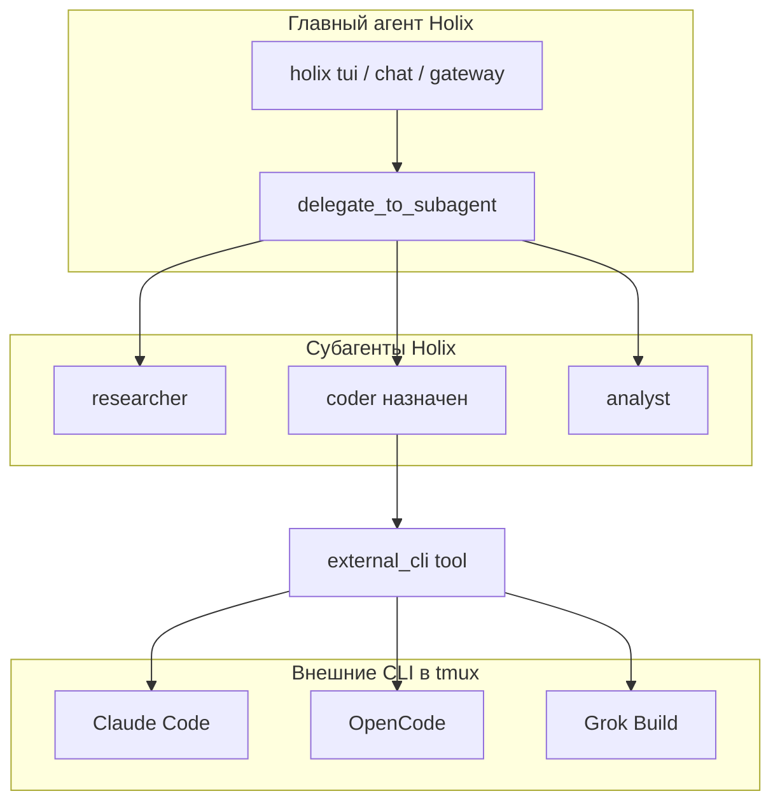

# Субагенты Holix и `holix launch`

Как связаны **субагенты Holix** и **`holix launch`** (внешние coding CLI в tmux).

## Две параллельные линии



| | Субагенты Holix | `holix launch` (терминал) |
|---|---|---|
| **Что это** | Фоновые воркеры внутри Holix | Отдельные терминальные агенты в tmux |
| **Запуск** | `delegate_to_subagent` | `holix launch …` (вручную) или `external_cli` от назначенного субагента |
| **Процесс** | asyncio или отдельный OS-процесс Holix | Свой бинарник (`claude`, `opencode`, `grok`) |
| **Модель** | Модель **родителя** (из `config.yaml` / default) | Модель из **слота** (`coder` по умолчанию) → `agent_models.coder` |
| **Инструменты** | Фиксированный набор из реестра (+ `external_cli` при назначении) | Свои tool'ы CLI |

---

## Что может главный агент

При `enable_subagents: true` главный агент координирует работу, но **не запускает внешние CLI напрямую**:

1. **Субагенты** — `delegate_to_subagent`, `wait_subagent_result`, `list_subagents`
2. **Внешние CLI** — только через **назначенного субагента** с tool `external_cli` (Linux/macOS)

Пример сценария:

```
Пользователь: «Исследуй API в фоне, а рефакторинг сделай в Claude Code»

Главный агент:
  delegate_to_subagent(researcher, "собери документацию по API …")
  delegate_to_subagent(coder, "рефакторинг auth модуля в Claude Code")

Субагент coder (если claude назначен coder в holix launch setup):
  external_cli(action=launch, cli_id=claude, task="рефакторинг auth модуля")
```

Пока идут субагенты, пользователь может продолжать чат с главным агентом. Внешний CLI живёт в своей tmux-сессии.

---

## Назначение субагента для внешних CLI

В `holix launch setup` для каждого включённого CLI сохраняется:

| Поле | Значение |
|------|----------|
| `enabled` | Включён ли CLI для профиля |
| `model_slot` | Слот модели профиля для внешнего CLI (`coder`, …) |
| `agent_slot` | Тип субагента, которому разрешён `external_cli` для этого CLI |

Правила Holix:

- **Главный агент** никогда не видит `external_cli` в списке инструментов.
- Субагент получает `external_cli` **только** если есть привязка с `enabled: true` и `agent_slot`, совпадающим с его типом (например `coder`).
- `external_cli(action=launch, …)` отклоняется, если вызывающий не тот субагент, привязка выключена или `cli_id` не настроен.

```bash
holix launch setup
# Включить claude → Слот модели: coder → Назначить субагенту: coder
```

---

## Что могут субагенты — и чего не могут

У каждого типа субагента есть **базовый список tool'ов** из реестра. Например, `coder`:

- `read_file`, `write_file`, `terminal`, `code_executor`
- `external_cli` — **добавляется автоматически**, если привязка назначает внешний CLI субагенту `coder`

Субагенты без назначения (`researcher`, `analyst`, …) не могут запускать внешние CLI.

---

## Важно: два разных «coder»

| Имя | Что это |
|-----|---------|
| Субагент `coder` | Тип воркера Holix (код через `read_file` / `terminal`; может использовать `external_cli` при назначении) |
| Слот `coder` в профиле | Модель для `holix launch` (`--model-slot coder`) |

Связь через **`holix launch setup`**:

- `agent_slot: coder` — какой субагент может вызывать `external_cli`
- `model_slot: coder` — какие учётные данные модели профиля передаются во внешний CLI

Субагент `coder` по-прежнему использует **модель родителя** для своих рассуждений в Holix (`config.model`), не `agent_models.coder`.

Настройка в `holix models setup`:

```yaml
agent_models:
  coder:
    provider: litellm
    model: coder
```

→ влияет на **`holix launch`** / env внешнего CLI, не на внутреннюю модель субагента.

---

## Типовые схемы работы

### 1. Главный делегирует; назначенный субагент запускает CLI

```
holix launch setup    # claude → enabled, agent_slot=coder

holix tui
  ├─ delegate_to_subagent(web_researcher) → фон
  ├─ delegate_to_subagent(coder) → запускает claude через external_cli
  └─ wait_subagent_result → вставить в ответ пользователю
```

### 2. Только субагенты (без внешних CLI)

Plan/Hybrid с `enable_subagents` — волны `researcher` → `coder` → `reviewer`. Всё внутри Holix, tmux не нужен.

### 3. Только внешние CLI (без субагентов)

```bash
holix launch claude -t "fix tests"
holix launch chat <session_id>
```

Главный агент Holix в этом сценарии не участвует.

### 4. Ручной параллелизм

- В одном терминале: `holix launch opencode`
- В TUI: субагент `analyst` на данных из репозитория

Связи между ними нет — только вы как координатор.

---

## Модели и профиль

| Компонент | Откуда модель |
|-----------|---------------|
| Главный агент | `default_model` / выбранная в TUI |
| Субагент | Та же, что у родителя |
| `holix launch <cli>` / `external_cli` | `model_slot` из binding + маппинг env/конфига CLI |

Один профиль → одни API-ключи, но **разные потребители**:

- субагенты → прямой LLM API Holix;
- launch → env / `opencode.json` / `config.toml` для внешнего CLI.

---

## Возможные доработки (сейчас не реализовано)

1. **Маппинг `agent_models.<тип>` → модель субагента** — чтобы внутренняя модель субагента `coder` совпадала со слотом `coder`.
2. **Оркестрация plan → launch** — шаг плана «запустить grok-build с задачей X» через делегирование субагенту + `external_cli`.

---

## Итог

Внешние CLI запускаются агентом **только через назначенных субагентов** с включёнными привязками. Главный агент делегирует; субагент с совпадающим `agent_slot` вызывает `external_cli`. Ручной `holix launch` из терминала доступен в любой момент.

---

## См. также

- [SUBAGENTS.md](SUBAGENTS.md) — как запускать и управлять субагентами
- [LAUNCH.md](LAUNCH.md) — `holix launch`
- [ARCHITECTURE.md](ARCHITECTURE.md) — субагенты и граф агента
- [CONFIGURATION.md](CONFIGURATION.md) — `enable_subagents`, `agent_models`