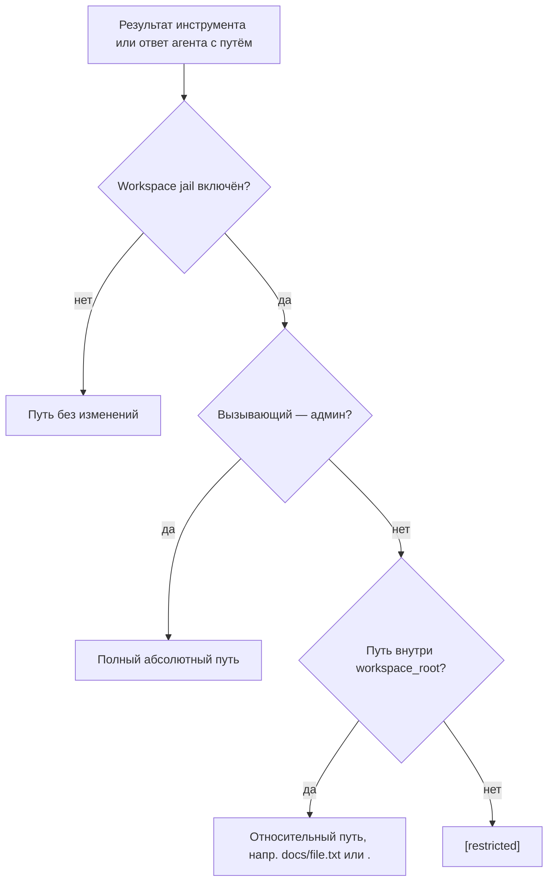

# Профили и изоляция

**Профили** Holix — полностью изолированные окружения агента на одной машине. У каждого профиля свои настройки, секреты, память, Telegram-бот и API gateway — разные люди или проекты не мешают друг другу.

### Профиль `default` (только для разработки)

В **development** (`HOLIX_ENV` не `production`) можно не указывать `-p` — Holix использует профиль `default`:

```bash
holix gateway start
holix profile env --edit
```

В **production** профиль `default` **недоступен**. Всегда указывайте именованный профиль:

```bash
HOLIX_ENV=production holix -p shared gateway start
HOLIX_ENV=production holix -p alice profile env --edit
```

## Что изолировано в профиле

| Ресурс | Путь |
|--------|------|
| Ключ доступа к профилю (хэш) | `~/.holix/profiles/<имя>/profile.key` |
| Окружение (ключи API, порты) | `~/.holix/profiles/<имя>/.env` |
| Telegram-бот | `~/.holix/profiles/<имя>/telegram.env` |
| Состояние и лог gateway | `~/.holix/profiles/<имя>/gateway/` |
| Модели, MCP, навыки | `~/.holix/profiles/<имя>/config.yaml` |
| Память (SQLite + ChromaDB) | `~/.holix/profiles/<имя>/data/memory/` |
| Навыки | `~/.holix/profiles/<имя>/data/skills/` |
| Cron-задачи | `~/.holix/profiles/<имя>/data/cron/` |
| Душа агента | `~/.holix/profiles/<имя>/SOUL.md` |
| Профиль пользователя | `~/.holix/profiles/<имя>/USER.md` |
| Маркер первого запуска | `~/.holix/profiles/<имя>/INIT.md` (удаляется после онбординга) |

Глобально в `~/.holix/`:

| Путь | Назначение |
|------|------------|
| `global/config.yaml` | Общие модели, MCP, search, поведение |
| `global/.env` | Общие ключи API, голос, флаги инструментов |
| `logs/`, клоны MCP | Общие операционные данные |

Профили **по умолчанию наследуют** глобальные настройки. Файлы профиля хранят **только переопределения** — можно сменить модель в одном профиле, не трогая global; изменение global обновит все наследующие профили.

```bash
holix profile global edit                 # общие настройки
holix profile create team-a               # наследует global (по умолчанию)
holix profile create team-b --clean       # чистый профиль
holix -p team-a config set model smart    # переопределить модель только в team-a
```

Токены Telegram, память и состояние gateway остаются **на профиль** (не наследуются).

## Идентичность агента (SOUL, INIT, USER)

В каждом профиле можно хранить **кто такой агент** и **кто такой пользователь** между сессиями.

| Файл | Назначение |
|------|------------|
| `SOUL.md` | Личность, ценности, тон и стиль агента |
| `USER.md` | Стабильные факты о человеке (имя, стиль работы, язык, заметки) |
| `INIT.md` | Маркер первого запуска — пока файл есть, Holix проводит короткий онбординг |

При `holix profile create <имя>` Holix создаёт `INIT.md` и заготовку `SOUL.md`.

### Первый диалог (онбординг)

Пока существует `INIT.md`, агент:

1. Представляется и узнаёт, как вам удобнее работать.
2. Сохраняет факты через `save_user_profile` → `USER.md` и долгосрочную память.
3. Сохраняет личность через `save_agent_soul` → `SOUL.md` (запись или дополнение).
4. Завершает `complete_agent_initialization` — удаляет `INIT.md`.

Можно писать «сохрани это как свою личность», «запомни, меня зовут …» в чате или Telegram — агент выберет нужный инструмент. Поддерживаются русский и английский.

### Каждая сессия

- **SOUL** вставляется как закреплённое system-сообщение в начале диалога и **восстанавливается после сжатия контекста**.
- **USER** попадает в system prompt, если есть `USER.md`.

Файлы можно править вручную:

```bash
holix -p alice profile env --edit   # только секреты
# файлы идентичности:
nano ~/.holix/profiles/alice/SOUL.md
nano ~/.holix/profiles/alice/USER.md
```

Чтобы снова пройти онбординг, создайте `INIT.md` вручную или заведите новый профиль.

## Несколько gateway и Telegram-ботов

Несколько gateway на разных портах — по одному на профиль:

```bash
# profiles/alice/.env
HOLIX_GATEWAY_PORT=8001

# profiles/bob/.env
HOLIX_GATEWAY_PORT=8002

holix -p alice gateway start
holix -p bob gateway start
```

У каждого профиля может быть **свой Telegram-бот**:

```bash
holix -p alice telegram setup
holix -p bob telegram setup
```

### Один бот на многих пользователей

**Рекомендуется** — запросы доступа + защищённый профиль на каждого:

```bash
holix -p shared telegram setup
HOLIX_ENV=production holix -p shared gateway start -f
# пользователи отправляют /start; админ одобряет:
holix -p shared telegram requests approve USER_ID --create-profile ivan
```

Каждому одобренному пользователю создаётся защищённый профиль, workspace jail и ключ доступа в Telegram.

Ручные привязки (`holix telegram map`) по-прежнему поддерживаются. См. [TELEGRAM_MULTI_PROFILE.md](TELEGRAM_MULTI_PROFILE.md).

## Workspace jail (изоляция в директории)

**Workspace jail** ограничивает файловые и терминальные инструменты одной директорией. Агент не может читать, писать или выполнять команды за её пределами, но внутри работает без ограничений.

**Автоматически:** при создании **защищённого** профиля (`--protect`, `profile key init` или `telegram requests approve --create-profile`) Holix создаёт:

`~/.holix/profiles/<имя>/workspace/`

и включает jail с корнем в этой директории.

**Вручную** (любой профиль):

```bash
holix profile jail enable ~/data-agent
holix profile jail status
holix profile jail disable
```

Или в `config.yaml`:

```yaml
workspace_jail_enabled: true
workspace_root: /home/user/data-agent
```

При включении jail действует на:

- `read_file`, `write_file`, `list_directory`
- `run_terminal_command` (рабочая директория = корень jail)
- отправку файлов в Telegram с локальных путей

Внутренние данные Holix (память, навыки в `~/.holix/profiles/`) **не затрагиваются** — jail только для файловых и терминальных инструментов агента.

### Видимость путей в ответах

При включённом workspace jail **не-администраторы** (владельцы профиля, пользователи Telegram, API-ключи без `admin`) видят в ответах агента и в выводе инструментов **только пути относительно workspace** — например `docs/readme.txt` или `.` для корня jail. Абсолютные пути выше workspace (`~/.holix/profiles/…`, каталоги хоста вне jail) заменяются на `[restricted]`.

**Администраторы** по-прежнему видят полные абсолютные пути:

| Роль | Что видит в чате / API / Telegram |
|------|-----------------------------------|
| Админ Telegram-бота (`HOLIX_TELEGRAM_ADMIN_USER_ID`) | Полные пути |
| API-ключ gateway с правом `admin` | Полные пути |
| Пользователь профиля с jail (CLI, Telegram, API без admin) | Только относительно `workspace_root` |
| Локальный CLI / TUI на хосте (без jail) | Полные пути (доверенный оператор) |

Санитизация применяется к результатам инструментов (`read_file`, `write_file`, `list_directory`, `run_terminal_command`), финальным ответам агента, стримингу и ошибкам отправки файлов в Telegram. Внутренние логи и admin management API (например `GET /api/holix/profiles/{id}/jail`) не меняются.

Пример для корня jail `/home/user/.holix/profiles/alice/workspace`:

```text
# Пользователь профиля видит
Content of docs/report.pdf: …
Updated notes.txt (+3 lines)

# Администратор видит
Content of /home/user/.holix/profiles/alice/workspace/docs/report.pdf: …
```



Админ: пользователь Telegram-бота из `HOLIX_TELEGRAM_ADMIN_USER_ID` или API-ключ gateway с правом `admin`.

## Whitelist терминала (опционально)

Ограничение списка shell-команд, которые агент может выполнять. Настройки хранятся в `.env` профиля.

```bash
holix -p dev profile whitelist enable
holix -p dev profile whitelist add "docker, make"
holix -p dev profile whitelist list
```

Переменные в `.env`:

```bash
HOLIX_TERMINAL_COMMAND_WHITELIST=true
HOLIX_TERMINAL_WHITELIST_EXTRA=docker,make
```

Holix всегда применяет встроенный набор для платформы (`ls`, `git status`, `python`, `holix` на Unix; `dir`, `type`, `where` в Windows). Extras профиля расширяют этот список. Дубликаты игнорируются.

После изменений перезапустите gateway/Telegram или заново запустите CLI. См. [TERMINAL_SECURITY.md](TERMINAL_SECURITY.md) и [SECURITY.md](SECURITY.md).

## Ключи доступа к профилю (опционально)

По умолчанию все профили **открыты** — переключение только по имени (`holix -p alice`, `/profile alice`).

При необходимости можно включить **ключ доступа** (формат `hp_…`): тогда переключиться в профиль из CLI, TUI, чата или Telegram можно только зная ключ. Ключ показывается **один раз**; в `~/.holix/profiles/<имя>/profile.key` хранится только хэш.

```bash
# Создать профиль (по умолчанию открытый)
holix profile create alice
holix -p alice gateway start

# Создать сразу с ключом + workspace jail
holix profile create bob --protect
# → ~/.holix/profiles/bob/workspace/ + profile.key (hp_…)

# Защитить существующий открытый профиль (также включает workspace jail)
holix -p alice profile key init

# Войти в защищённый профиль
holix -p bob --profile-key hp_xxxxxxxx
HOLIX_PROFILE_KEY=hp_xxxxxxxx holix -p bob

# Управление ключом активного профиля
holix profile key status
holix profile key rotate    # сменить ключ (нужен текущий)
holix profile key disable   # убрать ключ — снова свободное переключение по имени
```

Чтобы **отключить** защиту и переключаться свободно (только по имени профиля):

```bash
holix -p alice --profile-key <текущий-ключ> profile key disable
# или уже находясь в профиле:
holix -p alice profile key disable
```

После `key disable` файл `profile.key` удаляется, и `/profile alice` работает без ключа.

В интерактивном чате, TUI или Telegram:

```text
/profile alice hp_xxxxxxxx
```

`holix status` показывает режим доступа: `locked` (нужен ключ) или `open`.

Для **systemd** и фоновых процессов добавьте ключ в `.env` профиля, чтобы сервис стартовал без запроса:

```bash
# ~/.holix/profiles/alice/.env
HOLIX_PROFILE_KEY=hp_xxxxxxxx
```

Ключ защищает **переключение в** профиль через интерфейсы Holix. Он не заменяет права файловой системы на `~/.holix` и API-ключи gateway — см. [SECURITY.md](SECURITY.md).

Подробная инструкция по Telegram (один бот vs несколько ботов): [TELEGRAM_MULTI_PROFILE.md](TELEGRAM_MULTI_PROFILE.md).

Опциональное **шифрование at-rest** секретов и памяти (workspace остаётся plaintext): [PROFILE_ENCRYPTION.md](PROFILE_ENCRYPTION.md).

## Типичная настройка для нескольких пользователей

```bash
# Alice — разработчик, полный доступ к ФС
holix profile create alice
holix -p alice profile env --edit
holix -p alice telegram setup
holix -p alice gateway start

# Bob — только своя папка проекта (опционально с ключом)
holix profile create bob --protect
holix -p bob --profile-key <ключ> profile env --edit
holix -p bob profile jail enable /home/bob/projects
holix -p bob telegram setup
holix -p bob gateway start
```

## Удаление профиля

Удаление пользовательского профиля с сервера. Holix **сначала** уведомляет привязанных пользователей Telegram, затем удаляет данные.

**Защищённые профили** удалить нельзя: `default`, `docs`, `global`.

```bash
holix -p shared profile delete ivan --yes
holix -p shared profile delete ivan --yes --skip-notify   # без сообщения в Telegram
```

Порядок действий:

1. Поиск пользователей Telegram, привязанных к профилю (`telegram-users.json`, `HOLIX_TELEGRAM_USER_PROFILES` в `telegram.env`)
2. Отправка уведомления об удалении в Telegram (если не `--skip-notify`)
3. Удаление привязок Telegram для этого профиля
4. Очистка runtime-кэша и удаление `~/.holix/profiles/<имя>/`

Через Management API (admin-ключ gateway):

```bash
curl -X DELETE "$HOLIX_URL/api/holix/profiles/ivan?notify=true" \
  -H "Authorization: Bearer $ADMIN_KEY"
```

Параметр `notify=false` отключает уведомление. Поля ответа: `deleted`, `notified_users`, `notify_failed`, `mappings_removed`. См. [GATEWAY_API.md](GATEWAY_API.md).

## Справочник CLI

| Команда | Описание |
|---------|----------|
| `holix -p <имя> …` | Выбор профиля (для `default` не нужен) |
| `holix --profile-key <ключ>` | Ключ доступа к защищённому профилю |
| `holix profile create <имя>` | Создать профиль с наследованием global (по умолчанию) |
| `holix profile create <имя> --clean` | Чистый профиль без наследования global |
| `holix profile create <имя> --protect` | Создать профиль с ключом доступа |
| `holix profile global show` | Показать общий global config |
| `holix profile global edit` | Редактировать `global/config.yaml` |
| `holix profile global edit --env` | Редактировать `global/.env` |
| `holix profile global init` | (Пере)создать global (`--from-profile`) |
| `holix profile key status` | Защищён ли активный профиль |
| `holix profile key init` | Сгенерировать ключ для открытого профиля |
| `holix profile key rotate` | Сменить ключ доступа |
| `holix profile key disable` | Убрать ключ и разрешить свободное переключение |
| `holix profile env` | Показать `.env` профиля |
| `holix profile env --edit` | Редактировать секреты и bind gateway |
| `holix profile jail enable <path>` | Включить изоляцию в директории |
| `holix profile jail disable` | Выключить jail |
| `holix profile jail status` | Статус jail |
| `holix profile whitelist add "<команды>"` | Добавить команды через запятую |
| `holix profile whitelist list` | Статус whitelist и итоговый список |
| `holix profile whitelist enable` | Включить проверку whitelist |
| `holix profile delete <имя>` | Уведомить в Telegram, затем удалить профиль (`--yes`, `--skip-notify`) |
| `holix profile crypto …` | Шифрование секретов профиля (workspace остаётся plaintext) |
| `holix status` | Список профилей (`locked` / `open`) и активный |

В TUI/чате/Telegram: `/profile <имя> <ключ>` для переключения в защищённый профиль.

## systemd

Один instance gateway на профиль. Шаблонный unit `holix-gateway@<имя>`:

```bash
sudo systemctl enable --now holix-gateway@alice
sudo systemctl enable --now holix-gateway@bob
```

Профиль `default`: `holix-gateway.service`. Секреты в `profiles/<имя>/.env`, не в `/etc/holix/`.

Полная инструкция: [DEPLOYMENT.md](DEPLOYMENT.md#systemd).

## См. также

- [CONFIGURATION.md](CONFIGURATION.md) — слои env и YAML
- [GATEWAY.md](GATEWAY.md) — gateway на профиль
- [TELEGRAM.md](TELEGRAM.md) — бот на профиль
- [CLI.md](CLI.md) — справочник команд
- [SECURITY.md](SECURITY.md) — auth, подтверждения, production